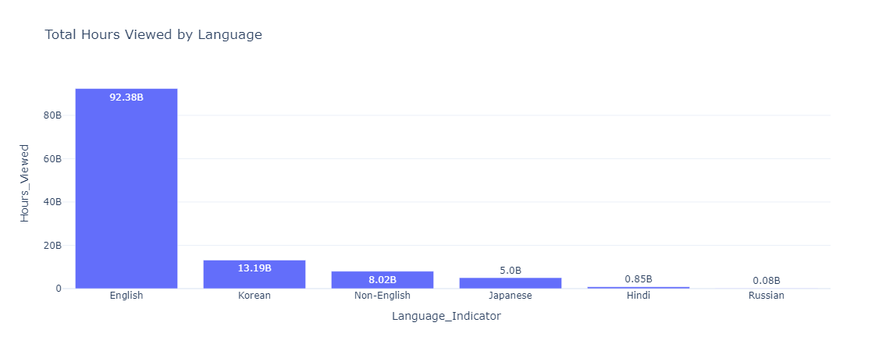
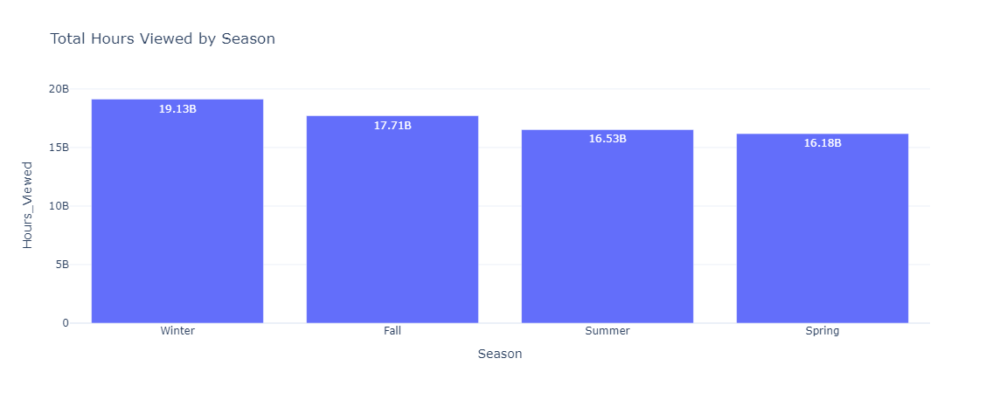
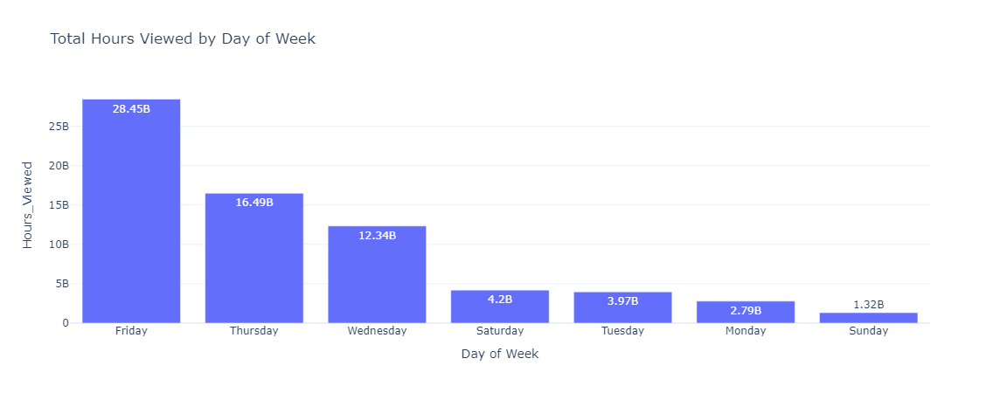

# Netflix Content Strategy Analysis
### Understanding What People Watch to Make Better Content Choices

---

## Overview
Conducted a detailed analysis of Netflix content viewership data for 2023 to determine optimal content types. Examined total hours viewed, growth rates, and patterns including seasonal, monthly, and weekly viewership. Aims to enhance content strategies for Netflix to boost viewership.

---

## Dataset Details
- **Total Records**: Initiated with 24,812 records in dataset.
- **Records After Cleaning**: Post removal of duplicates, null values, and invalid entries (e.g., zero or negative hours viewed), retained 19,158 records for analysis.

---

## Tools Used
Utilized Python with following libraries:
- **Pandas**: For data cleaning and analysis.
- **Plotly**: For generating bar charts and line plots to display results.

---

## Analysis and Results

### 1. Total Hours Viewed by Content Type
Assessed viewership hours for Shows and Movies:
- **Shows**: 74.63 billion hours
- **Movies**: 44.89 billion hours

**Insight**: Shows outperform Movies in viewership. Recommend prioritizing development of engaging Shows.

### 2. Total Hours Viewed by Language
Evaluated viewership based on content language:
- **English**: 92.38 billion hours
- **Korean**: 13.19 billion hours
- **Non-English**: 8.02 billion hours
- **Japanese**: 5.00 billion hours
- **Hindi**: 0.85 billion hours
- **Russian**: 0.08 billion hours

**Insight**: English content dominates viewership, followed by Korean. Suggest increased investment in English and Korean content to maximize audience reach.

### 3. Growth Rate Analysis
Investigated viewership growth from 2015 to 2023:
- English and Korean content exhibited highest growth rates (as seen in yearly trends).

**Insight**: Rising popularity of these languages indicates sustained production in English and Korean to leverage growth trends.

### 4. Seasonal Viewership Analysis
Analyzed viewership by release season (based on release date):
- **Winter**: 19.13 billion hours
- **Fall**: 17.71 billion hours
- **Summer**: 16.53 billion hours
- **Spring**: 16.18 billion hours

**Insight**: Winter yields highest viewership (based on release dates), potentially due to holidays. Propose scheduling major Show or Movie releases in Winter to optimize viewership.

### 5. Monthly Viewership Analysis
Examined viewership per month (based on release date):
- **December**: 7.93 billion hours (Top 1)
- **June**: 6.22 billion hours (Top 2)
- **May**: 5.22 billion hours (Bottom 2)
- **July**: 4.98 billion hours (Bottom 1)

**Insight**: December records peak viewership (based on release dates), likely holiday-driven. Advise planning significant releases in December and June for enhanced viewership.

### 6. Weekly Viewership Analysis
Investigated viewership by release day:
- **Friday**: 28.45 billion hours
- **Thursday**: 16.49 billion hours
- **Wednesday**: 12.34 billion hours
- **Saturday**: 4.20 billion hours
- **Tuesday**: 3.98 billion hours
- **Monday**: 2.80 billion hours
- **Sunday**: 1.32 billion hours

**Insight**: Friday releases achieve highest viewership, possibly due to weekend viewing habits. Recommend scheduling new content releases on Fridays to capture larger audiences.

---

## Assumptions and Limitations
Formulated assumptions during analysis:
- `Hours_Viewed` data reflects total views per title, lacking specific viewing timestamps. Thus, seasonal, monthly, and weekly analyses rely solely on release dates, not actual viewing dates.
- Analysis provides foundational overview of content data study, yet lacks precision for seasonal or weekly patterns due to absence of view timing data.

With enhanced dataset including:
- Viewer region or country
- Genre (e.g., Action, Drama, Anime)
- Periodical views (e.g., daily/weekly per title)
- Additional variables (e.g., age group, device type)
Future analysis could yield deeper insights. Plan to conduct **Content Strategy Analysis Version-2** with such data for improved utility.

---

## Key Takeaways for Content Strategy
- Prioritize production of **Shows** due to higher viewership compared to Movies.
- Allocate resources to **English** and **Korean** content given dominant viewership and growth trends.
- Target **Winter** (particularly December) for major releases to capitalize on holiday viewership spikes (based on release dates).
- Schedule new content drops on **Fridays** to align with peak weekend viewing.

---

## Future Steps
Intend to source enhanced dataset with details on region, genre, and daily views. Aim to perform more precise analysis in **Content Strategy Analysis Version-2** subsequently.

---

## Author

  

**Author**: [Pavan Yellathakota]  
**Date**: MAR 2025  

---

## Contact Information

You can reach out to me through the following channels:

- **Email**: [pavanyellathakota@gmail.com](mailto:pavanyellathakota@gmail.com)
- **LinkedIn**: [Pavan Yellathakota](https://www.linkedin.com/in/pavanyellathakota/)

For more projects and resources, check out:

- **GitHub**: [Pavan Yellathakota](https://github.com/PavanYellathakota)
- **Portfolio**: [pye.pages.dev](https://pye.pages.dev)

---
